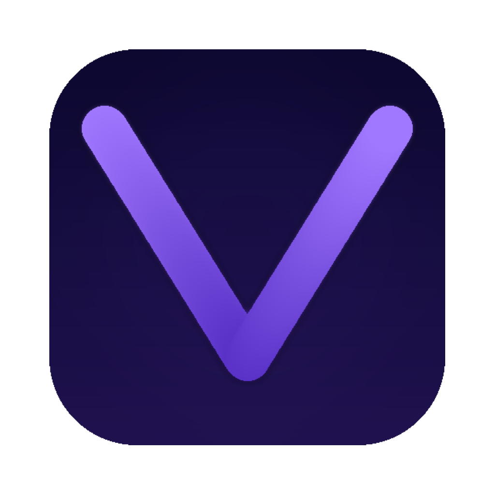

<div align="center">



# Vyro Browser

**The AI-first desktop browser. Local. Private. Fast.**

[](https://github.com/Gaurav06120714/VyroBrowser/releases)
[](https://github.com/Gaurav06120714/VyroBrowser/releases)
[](https://github.com/Gaurav06120714/VyroBrowser/releases)
[](https://www.electronjs.org/)
[](https://react.dev/)
[](https://www.typescriptlang.org/)
[](LICENSE)
[](https://github.com/Gaurav06120714/VyroBrowser/releases/latest)

[**Download**](#-download) · [**Install from Source**](#-install-from-source) · [**Ollama Setup**](#-ollama-setup) · [**Features**](#-features) · [**Architecture**](#-architecture) · [**Contributing**](#-contributing)

---

> Vyro is a Chromium-based desktop browser built on Electron that runs a **local AI assistant powered by Ollama** — your AI data never leaves your machine. Every inference, every suggestion, every summary happens entirely on-device.

</div>

---

## 📥 Download

Latest release: **v2.0.0**

| Platform | Installer | Notes |
|---|---|---|
| **macOS** (Apple Silicon M1/M2/M3) | [Vyro-2.0.0-arm64.dmg](https://github.com/Gaurav06120714/VyroBrowser/releases/download/v2.0.0/Vyro-2.0.0-arm64.dmg) | Drag to Applications |
| **macOS** (Intel) | [Vyro-2.0.0-x64.dmg](https://github.com/Gaurav06120714/VyroBrowser/releases/download/v2.0.0/Vyro-2.0.0-x64.dmg) | Drag to Applications |
| **Windows** x64 | [Vyro-2.0.0-Setup.exe](https://github.com/Gaurav06120714/VyroBrowser/releases/download/v2.0.0/Vyro-2.0.0-Setup.exe) | Run installer |
| **Linux** x64 | [Vyro-2.0.0-x86_64.AppImage](https://github.com/Gaurav06120714/VyroBrowser/releases/download/v2.0.0/Vyro-2.0.0-x86_64.AppImage) | `chmod +x` then run |

> **Unsigned builds:** macOS → Right-click → Open. Windows → "More info" → "Run anyway".

---

## ⚡ Install from Source

### macOS / Linux

```bash
# 1. Clone
git clone https://github.com/Gaurav06120714/VyroBrowser.git
cd VyroBrowser/apps/browser

# 2. Install dependencies (auto-rebuilds native modules via postinstall)
npm install

# 3a. Run in development mode (Vite HMR + TypeScript watch)
npm run dev

# 3b. OR build and install directly to /Applications
npm run install-app
```

### Windows

```powershell
# Prerequisite: Visual Studio Build Tools with "Desktop development with C++"
# https://visualstudio.microsoft.com/downloads/

git clone https://github.com/Gaurav06120714/VyroBrowser.git
cd VyroBrowser\apps\browser

npm install

# Run in development mode
npm run dev
```

### Build a distributable installer

```bash
npm run package:mac    # → dist/Vyro-*.dmg  (macOS, arm64 + x64)
npm run package:win    # → dist/Vyro-*-Setup.exe   (Windows — run on Windows)
npm run package:linux  # → dist/Vyro-*.AppImage    (Linux)
npm run package:all    # → all platforms at once
```

> **Windows installer** must be built on a Windows machine or via GitHub Actions (push a `v*.*.*` tag to trigger the release workflow).

---

## 🤖 Ollama Setup

Vyro's onboarding wizard guides you through this on first launch. You can also set it up manually:

### macOS

```bash
brew install ollama
brew services start ollama
ollama pull llama3.2
```

Apple Silicon: Ollama uses Metal GPU acceleration automatically on M1/M2/M3/M4.

### Windows

1. Download from [ollama.ai/download/windows](https://ollama.ai/download/windows)
2. Run the installer — Ollama starts as a background service

```powershell
ollama pull llama3.2
```

### Linux

```bash
curl -fsSL https://ollama.ai/install.sh | sh
sudo systemctl enable --now ollama
ollama pull llama3.2
```

---

## ✅ Platform Support Matrix

| Feature | macOS | Windows | Linux |
|---|:---:|:---:|:---:|
| Tabbed browsing | ✅ | ✅ | ✅ |
| Native vibrancy / glass | ✅ | ✅¹ | — |
| System tray | — | ✅ | ✅ |
| Custom title bar | ✅ | ✅ | — |
| Keyboard shortcuts (Cmd/Ctrl) | ✅ | ✅ | ✅ |
| AI assistant (Ollama) | ✅ | ✅ | ✅ |
| One-click model install | ✅ | ✅ | ✅ |
| Ad-blocking | ✅ | ✅ | ✅ |
| Reader mode + TTS | ✅ | ✅ | ✅ |
| Per-profile sessions | ✅ | ✅ | ✅ |
| DMG installer | ✅ | — | — |
| NSIS installer | — | ✅ | — |
| AppImage / .deb | — | — | ✅ |
| GPU acceleration | ✅ | ✅² | ✅ |
| Dock / Start Menu shortcut | ✅ | ✅ | ✅ |
| Crash recovery | ✅ | ✅ | ✅ |
| CSP (renderer shell) | ✅ | ✅ | ✅ |

¹ Acrylic-inspired glassmorphism via CSS `backdrop-filter: blur()`
² Requires NVIDIA/AMD drivers

---

## 🎓 Onboarding Walkthrough

Vyro shows a guided first-launch wizard on every fresh install.

```
┌──────────────────────────────────────────────────────────────────────┐
│  Step 1 · Welcome                                                    │
│  Detects your OS — shows platform-optimized messaging + features     │
│                                                                      │
│  Step 2 · Ollama Detection                                           │
│  Pings localhost:11434 · "Check Again" button                        │
│  Platform-specific install command with one-click copy               │
│                                                                      │
│  Step 3 · Model Selection                                            │
│  Grid of 5 models with size, RAM requirement, recommended badge      │
│  One-click install · live download progress bar · cancel support     │
│                                                                      │
│  Step 4 · Ready                                                      │
│  AI health verification · keyboard shortcut cheatsheet               │
│  "Launch Vyro" button → opens the browser UI                         │
└──────────────────────────────────────────────────────────────────────┘
```

Every step has a "Skip for now" option — you'll never be stuck.

**Reset onboarding:**

```js
// Run in browser DevTools (Cmd/Ctrl+Alt+I)
localStorage.removeItem('vyro:onboarding:complete');
location.reload();
```

---

## 🧠 AI Model Catalog

| Model | Size | RAM Needed | Best For |
|---|---|---|---|
| **llama3.2** ⭐ | 2.0 GB | ~3 GB | General chat, reasoning |
| **qwen2.5-coder** | 4.7 GB | ~6 GB | Code generation, debugging |
| **mistral** | 4.1 GB | ~6 GB | Fast responses, Q&A |
| **codellama** | 3.8 GB | ~6 GB | Code completion, refactoring |
| **deepseek-coder** | 3.8 GB | ~6 GB | Complex reasoning, analysis |

---

## ✨ Features

### Cross-Platform Browser Shell
- Tabbed browsing — open, close, reorder, pin, group tabs; restore recently closed
- Address bar — URL navigation + keyword shortcuts + AI queries
- Smart keyword navigation — `gh react`, `yt lofi` → jump directly to the right URL
- Find in page — `Cmd/Ctrl+F` inline search
- Zoom controls — per-tab zoom with on-screen indicator
- Command palette — `Cmd/Ctrl+K` fuzzy search over tabs, bookmarks, history

### Windows Premium Support
- Custom `WindowsTitleBar` — minimize / maximize / close with proper drag region
- Acrylic-inspired glassmorphism via `backdrop-filter: blur()`
- System tray — hide/show window, New Tab, Quit
- NSIS installer with Desktop + Start Menu shortcuts

### First-Launch Onboarding
- 4-step wizard: Welcome → Ollama detection → Model download → Ready
- Platform detection with OS-specific install commands
- Live Ollama health check + one-click model installation with streaming progress
- Never blocks the user — skip available at every step

### Full Ollama Integration
- Streaming NDJSON chat responses token-by-token
- Model pull with real-time progress (percent + status) + cancel support
- Per-conversation model selection
- Auto-reconnect on Ollama service restart

### Modern Browser Features
- **Ad-blocking** — network-level via `@cliqz/adblocker-electron`; per-site toggle
- **Reader mode** — clean article extraction from any page
- **Text-to-speech** — read articles aloud
- **Bookmarks** — tree-organised; import/export
- **History** — full navigation history with search
- **Downloads manager** — pause/resume/cancel with progress
- **Per-profile sessions** — isolated cookies/storage per profile
- **Custom injections** — per-origin CSS/JS
- **Permissions dialog** — camera/microphone/geolocation prompts

### Security & Privacy
- **Context isolation** — renderer fully sandboxed from Node.js
- **IPC allowlist** — only whitelisted channels pass through the preload bridge
- **Content Security Policy** — applied to renderer shell
- **Zero telemetry** — nothing sent to any external server
- **Local AI only** — prompts never leave your machine
- **Webview isolation** — each tab has its own session partition

---

## 🏗 Architecture

```
VyroBrowser/
└── apps/browser/
    ├── src/
    │   ├── main/               Electron main process (Node.js)
    │   │   ├── index.ts            App entry, lifecycle, tray, shortcuts
    │   │   ├── window-manager.ts   Cross-platform window + CSP
    │   │   ├── tray.ts             System tray (Windows/Linux)
    │   │   ├── ipc/                IPC handlers (tabs, nav, AI, downloads…)
    │   │   │   └── onboarding.ts   Ollama check, model pull, streaming
    │   │   ├── services/
    │   │   │   ├── ai-service.ts   Ollama HTTP + streaming
    │   │   │   ├── db.ts           SQLite init + migrations
    │   │   │   └── ...
    │   │   ├── adblock/            Network-level request filtering
    │   │   └── preload/            contextBridge — window.vyro API
    │   │
    │   ├── renderer/           React renderer process (Vite)
    │   │   ├── App.tsx             Root — onboarding gate + browser shell
    │   │   ├── pages/
    │   │   │   ├── Onboarding.tsx  4-step first-launch wizard
    │   │   │   └── NewTab.tsx      Speed dial + search home page
    │   │   ├── components/
    │   │   │   ├── browser/        TabBar, AddressBar, CommandPalette…
    │   │   │   │   └── WindowsTitleBar.tsx  Custom titlebar (Windows)
    │   │   │   └── sidebar/        AIPanel, History, Bookmarks…
    │   │   └── store/              Zustand (tabs, AI, UI, settings…)
    │   │
    │   └── shared/             Compiled into both processes
    │       └── ipc-channels.ts     All IPC channels + INVOKE/PUSH allowlists
    │
    ├── assets/                 Icons (icns, ico, png)
    └── .env.example            Environment variable template
```

### IPC Security Model

```
Renderer (React)                contextBridge               Main (Node.js)
────────────────                ─────────────               ──────────────
window.vyro.invoke()  ────────► INVOKE_ALLOWLIST  ────────► ipcMain.handle()
window.vyro.on()      ◄────────  PUSH_ALLOWLIST   ◄────────  webContents.send()
```

> **Adding a new IPC channel?** Always add it to `INVOKE_ALLOWLIST` or `PUSH_ALLOWLIST` in `src/shared/ipc-channels.ts` — the preload drops any unlisted channel and the renderer will show a blank screen.

---

## ⌨️ Keyboard Shortcuts

> **Cmd** on macOS · **Ctrl** on Windows/Linux

| Shortcut | Action |
|---|---|
| `Cmd/Ctrl + T` | New tab |
| `Cmd/Ctrl + W` | Close current tab |
| `Cmd/Ctrl + L` | Focus address bar |
| `Cmd/Ctrl + R` | Reload page |
| `Cmd/Ctrl + [` | Go back |
| `Cmd/Ctrl + ]` | Go forward |
| `Cmd/Ctrl + F` | Find in page |
| `Cmd/Ctrl + K` | Command palette |
| `Cmd/Ctrl + Tab` | Next tab |
| `Cmd/Ctrl + Shift + Tab` | Previous tab |
| `Cmd/Ctrl + 1–8` | Switch to tab N |
| `Cmd/Ctrl + +` / `-` | Zoom in / out |
| `Cmd/Ctrl + 0` | Reset zoom |
| `Cmd/Ctrl + Alt + I` | Open DevTools |

---

## 🖥 Platform Notes

### macOS
- Native `vibrancy: 'under-window'` for translucent chrome
- Traffic lights via `titleBarStyle: 'hiddenInset'`
- Dock menu: New Window / New Tab (right-click Dock icon)
- `window-all-closed` keeps app alive in Dock (Chrome/Arc behaviour)
- **Gatekeeper bypass:** Right-click → Open in Finder, then click Open

### Windows
- `WindowsTitleBar.tsx` replaces native frame
- System tray: hide/show window, New Tab, Quit
- NSIS installer creates Desktop + Start Menu shortcuts
- **SmartScreen bypass:** Click "More info" → "Run anyway"

### Linux
- Standard native frame for compositor compatibility
- AppImage: `chmod +x Vyro-*.AppImage && ./Vyro-*.AppImage`
- .deb: `sudo dpkg -i Vyro-*.deb`

---

## 🔧 Troubleshooting

| Problem | Solution |
|---|---|
| **Blank screen on startup** | Delete `/Applications/Vyro.app`, clean build: `rm -rf dist/mac-arm64 dist-main && npm run install-app` |
| `better-sqlite3` architecture mismatch | `npm install` (postinstall auto-rebuilds via electron-builder) |
| `better-sqlite3` compile error on Windows | Install VS Build Tools 2022 with "Desktop development with C++" |
| IPC channel blocked error | Add the channel to `INVOKE_ALLOWLIST` or `PUSH_ALLOWLIST` in `src/shared/ipc-channels.ts` |
| AI panel shows "Ollama not running" | `ollama serve` or `brew services start ollama` (macOS) |
| Packaged app blocked by Gatekeeper | Right-click → Open in Finder → Open |
| Packaged app blocked by SmartScreen | Click "More info" → "Run anyway" |
| Linux: SUID sandbox error | Run with `--no-sandbox` flag |
| Window opens off-screen | Delete `~/Library/Application Support/Vyro/window-state.json` (macOS) |
| Build uses stale files | `rm -rf dist/mac-arm64 dist-main` then rebuild |

---

## 🗺 Roadmap

### ✅ Completed (v2.0.0)

- [x] Cross-platform packaging — macOS (dmg), Windows (NSIS), Linux (AppImage/deb)
- [x] Platform-safe window manager — vibrancy on macOS, custom titlebar on Windows
- [x] First-launch onboarding wizard — Ollama detection, model download, auto-redirect
- [x] System tray — Windows and Linux
- [x] One-click model installation — live progress, cancel, retry
- [x] Full Ollama integration — streaming chat, model listing, diagnostics
- [x] AI sidebar — streaming chat, conversation history, multi-model support
- [x] Ad-blocking — network-level, per-site toggle
- [x] Reader mode + TTS, Command palette, Per-profile sessions
- [x] Bookmarks, History, Downloads managers
- [x] GitHub Actions CI/CD (auto-release on macOS / Windows / Linux)
- [x] IPC security allowlist (INVOKE_ALLOWLIST + PUSH_ALLOWLIST)

### 🚧 Planned

- [ ] Vertical tabs sidebar
- [ ] Split view (side-by-side tabs)
- [ ] AI omnibox — `?` prefix to query AI from address bar
- [ ] Explain / rewrite / translate via context menu
- [ ] Privacy dashboard — per-page tracker breakdown
- [ ] Tab sleeping / memory saver
- [ ] Auto-update (electron-updater)
- [ ] Chrome extension compatibility (MV3)
- [ ] Sync (bookmarks + history across devices)
- [ ] Vitest unit tests + Playwright E2E tests

---

## 🆚 Vyro vs. Alternatives

| Feature | Vyro | Chrome | Arc | Brave |
|---|:---:|:---:|:---:|:---:|
| Local AI (no API key) | ✅ | ❌ | ❌ | ❌ |
| Open source | ✅ | ❌ | ❌ | ✅ |
| Zero telemetry | ✅ | ❌ | ❌ | ⚠️ |
| Built-in ad-blocking | ✅ | ❌ | ❌ | ✅ |
| Windows support | ✅ | ✅ | ❌ | ✅ |
| Linux support | ✅ | ✅ | ❌ | ✅ |
| Reader mode | ✅ | ❌ | ✅ | ✅ |
| Command palette | ✅ | ❌ | ✅ | ❌ |
| Custom injections | ✅ | ❌ | ❌ | ❌ |
| Keyword shortcuts | ✅ | ❌ | ❌ | ❌ |

---

## 🤝 Contributing

Contributions are welcome!

```bash
# Fork, clone, install
git clone https://github.com/<your-fork>/VyroBrowser.git
cd VyroBrowser/apps/browser
npm install

# Create a branch
git checkout -b feat/your-feature

# Make changes, then
git commit -m "feat: add vertical tabs sidebar"
```

Open a PR against `main`. CI runs lint + build + package on all 3 platforms automatically.

**Development tips:**
- Renderer changes: instant via Vite HMR
- Main process changes: requires restarting `npm run dev`
- New IPC channels: always add to `src/shared/ipc-channels.ts` allowlists **before** calling from renderer
- After editing IPC allowlists: `rm -rf dist-main && npm run build:main` then rebuild the app

---

## 📄 License

[MIT](LICENSE) — free to use, modify, and distribute.

---

<div align="center">

Built with ❤️ using Electron · React · TypeScript · Ollama

[Report a Bug](https://github.com/Gaurav06120714/VyroBrowser/issues) · [Request a Feature](https://github.com/Gaurav06120714/VyroBrowser/issues) · [Releases](https://github.com/Gaurav06120714/VyroBrowser/releases)

</div>
“YOLO badge update”
YOLO badge update
